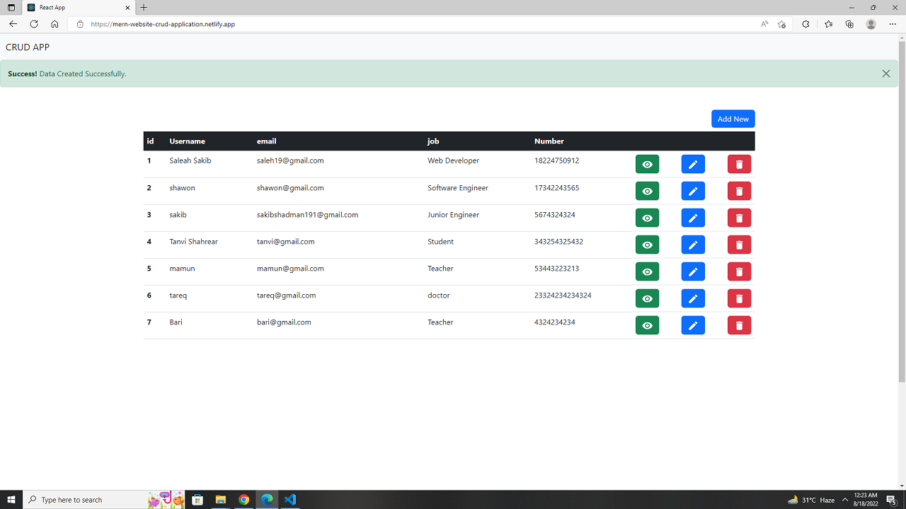

# Crud Website with MERN
    
  

### Live Link - https://mern-website-crud-application.netlify.app/

 

I used React, React Router, Nodejs, Expressjs, MongoDB, Bootstrap to build the project  .
 

### Env Variables 
DATABASE =
 

### Author Links  

👋 Hello,I am Shadman and I am a Full Stack Web developer  

🚀 Follow me:  

  - [Github](https://github.com/sakibshadman19)
  - [LinkedIn](https://www.linkedin.com/in/shadmansakib1/)

  

<!-- all link is here -->

